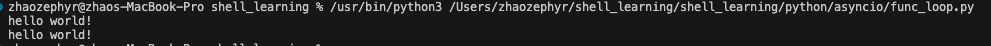
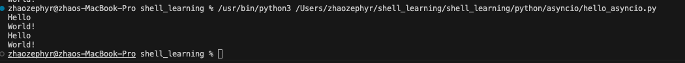
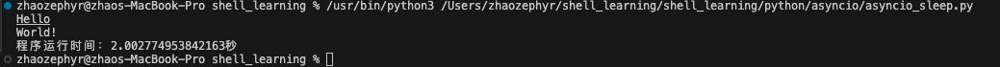
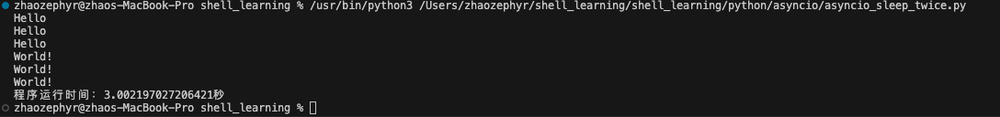
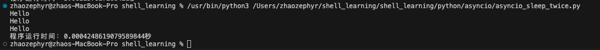

# 事件循环
正常情况下，我们可以创建一个事件循环来循环运行某些io密集的任务，比如：
```python
# func_loop.py
def say_hello():
    print("hello world!")


def main():
    fun_list = [
        say_hello(),
        say_hello()
    ]
    for f in fun_list:
        f


if __name__ == "__main__":
    main()
```


但是我们这里的程序是有问题的，我们的程序实际上还是顺序执行的。我们的目标当然是可以让程序在运行io密集任务时，不阻塞主线程，从而提高程序的响应速度。
如何做到呢？我们接着看：
# asyncio
我们先来看看这个库的简单使用：
```python
# hello_asyncio.py
import asyncio


async def wait_hello_world(seconds):
    print("Hello")
    await asyncio.sleep(seconds)
    print("World!")


async def main():
    # 我们手动创建一个事件循环
    func_list = [
        wait_hello_world(2),
        wait_hello_world(3)
    ]
    for func in func_list:
        await func

if __name__ == "__main__":
    asyncio.run(main())
```
这里我们首先创建了一个事件循环，然后我们创建了一个列表，列表中包含了我们想要运行的io密集任务。然后我们使用`asyncio.run`来运行事件循环。

我们已经简单用了一下asyncio了，但是这显然不是我们的目标，因为他运行的时候还是没有把任务放在后台去执行。别忘了我们最终的目标是让他放在后台去执行。
我们接着看：
# asyncio.create_task
我们之前的办法好像都不太直观，我们加个时间看看：
```python
# asyncio_sleep.py
import time
import asyncio


async def wait_hello_world(seconds):
    print("Hello")
    await asyncio.sleep(seconds)
    print("World!")


async def main():
    # 我们手动创建一个事件循环
    task1 = asyncio.create_task(
        wait_hello_world(2)
        )
    await task1

if __name__ == "__main__":
    start_time = time.time()
    asyncio.run(main())
    end_time = time.time()
    print(f"程序运行时间：{end_time - start_time}秒")
```

我们可以看到，程序运行了2秒，中间我们sleep了2秒
我们继续改进一下我们的程序看看：
```python
# asyncio_sleep_twice.py
import time
import asyncio


async def wait_hello_world(seconds):
    print("Hello")
    await asyncio.sleep(seconds)
    print("World!")


async def main():
    # 我们手动创建一个事件循环
    func_list = [
        wait_hello_world(1),
        wait_hello_world(2),
        wait_hello_world(3)
    ]
    await_list = []
    for func in func_list:
        await_list.append(asyncio.create_task(func))
    for await_func in await_list:
        await await_func

if __name__ == "__main__":
    start_time = time.time()
    asyncio.run(main())
    end_time = time.time()
    print(f"程序运行时间：{end_time - start_time}秒")

```
这个程序大家觉得会运行多久？为什么？

我们来看一下这个程序的运行结果：

# task
有朋友说，上面的代码不都一样嘛，不就是并发执行了一下？
我们换个方式：
```python
# asyncio_sleep_twice.py
import time
import asyncio


async def wait_hello_world(seconds):
    print("Hello")
    await asyncio.sleep(seconds)
    print("World!")


async def main():
    # 我们手动创建一个事件循环
    func_list = [
        wait_hello_world(1),
        wait_hello_world(2),
        wait_hello_world(3)
    ]
    await_list = []
    for func in func_list:
        await_list.append(asyncio.create_task(func))
    # for await_func in await_list:
    #     await await_func

if __name__ == "__main__":
    start_time = time.time()
    asyncio.run(main())
    end_time = time.time()
    print(f"程序运行时间：{end_time - start_time}秒")

```
猜猜上面的程序运行结果是什么？

揭秘一下：

没想到吧，我不进行await操作，就不会执行sleep，也不会执行world这一条。
这里的await到底起了什么作用？

> await的作用就是，我等待这个任务（Task）执行完毕，再继续执行我的程序。

那上面的create_task是什么意思呢？他的意思就是我创建一个任务，并把这个任务加入到事件循环中。
